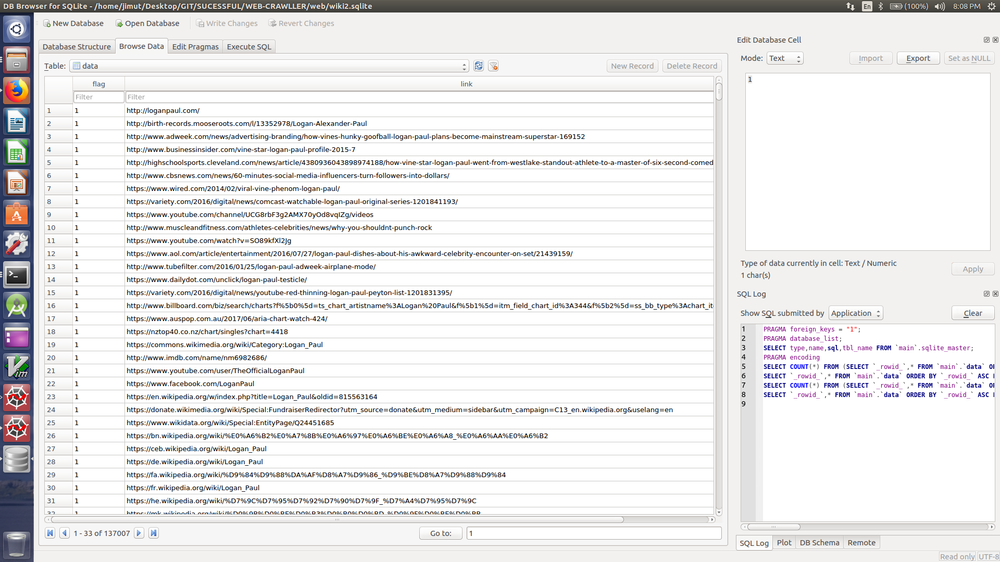

# WEB-CRAWLLER
A web crawller which crawls through the whole internet 
   -- A winter proj by [Jimut Bahan Pal](https://www.linkedin.com/in/jimut-bahan-pal-156862123/)
## Requirements ::
```
python3
```
```
sudo apt-get install sqlite
```
```
pip install bs4
```
#### For running the program ::
```
git clone https://github.com/Jimut123/WEB-CRAWLLER.git

cd WEB-CRAWLLER

cd web

python3 craw3.py
 
```

## A glance of the database is given here
The links collected are set to 0
#### Some Glances of Data Collected (travelled links)

This is set to 1 as the link is visited once
#### Some Glances of Data Collected (untravelled links)


****
This program crawls through a given link supplied, collects the link and stacks the links in the queue,
the dummy is initialized to 0 at the beginning,dummy is set to 1 as the link is visited, this ensures that
one link is travelled only once. This is used under a try catch block, it even waits for network if the net is slow,
or doesn't blows off, even if the link cannot be opened, it sets the dummy variable to 1. This project is done by me
as a winter project, this program is perfect in all respects. It collected around 60k links in one shot for running 
upto 4 hours. This thing is unstopabble, doesn't stop if ctrl+C or ctrl+D is pressed, this is designed for this purpose 
solely. 
****
